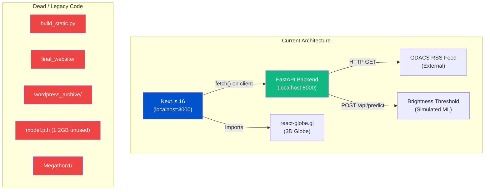

# Professional Code Review — Disaster Awareness Platform

**Reviewer:** Industry-Grade Automated Audit  
**Date:** April 5, 2026  
**Scope:** Full-stack review — Next.js 16 frontend + Python FastAPI backend  
**Verdict:** 🔴 **NOT PRODUCTION-READY** — 14 Critical/High issues must be resolved

---

## Executive Summary

| Category | Score | Status |
|----------|-------|--------|
| **Architecture & Structure** | 3/10 | 🔴 Critical |
| **Code Quality & Standards** | 4/10 | 🔴 Critical |
| **Visual / UI Integrity** | 4/10 | 🔴 Critical |
| **Mobile Responsiveness** | 2/10 | 🔴 Critical |
| **Security** | 2/10 | 🔴 Critical |
| **Accessibility (a11y)** | 2/10 | 🔴 Critical |
| **Performance & SEO** | 4/10 | 🟡 Medium |
| **Backend (Python)** | 5/10 | 🟡 Medium |
| **Content & Copywriting** | 3/10 | 🔴 Critical |
| **Overall** | **3.2 / 10** | 🔴 **Failing** |

---

## Visual Evidence

### Homepage (Desktop)
````carousel

<!-- slide -->

````

### Homepage (Mobile — 375px)


### Inner Pages
````carousel

<!-- slide -->

<!-- slide -->

<!-- slide -->

<!-- slide -->

<!-- slide -->

<!-- slide -->

````

---

## 🔴 CRITICAL SEVERITY (P0 — Must Fix)

### 1. Material Icons Font Not Loaded — Broken Icons Across All Pages

**Files:** All `page.js` files that reference `material-symbols-outlined`  
**Evidence:** See [Satellite Hub screenshot](#inner-pages), [Reference Guide screenshot](#inner-pages), [Blog screenshot](#inner-pages)

The codebase uses `<span className="material-symbols-outlined">cloud_upload</span>`, `explore`, `schedule`, `seismology`, `water_drop`, `cyclone` throughout multiple pages, but **the Google Material Symbols font is never imported anywhere** — not in [layout.js](file:///d:/Downloads/New%20folder/next_app/src/app/layout.js), not in [globals.css](file:///d:/Downloads/New%20folder/next_app/src/app/globals.css), nowhere.

**Result:** Users see raw text strings (`cloud_upload`, `smol`, `er_d`, `yclon`, `schedule`, `explore`) rendered inside icon containers. This is visible on **5 out of 7 pages**.

> [!CAUTION]
> This is the single most visible bug in the entire application. Every page except Home and Live Map has broken icons. An evaluator will see this within 2 seconds.

**Fix:** Add to `layout.js` `<head>`:
```html
<link href="https://fonts.googleapis.com/css2?family=Material+Symbols+Outlined" rel="stylesheet" />
```

---

### 2. Zero Mobile Responsiveness — No Hamburger Menu

**File:** [layout.js:21](file:///d:/Downloads/New%20folder/next_app/src/app/layout.js#L21)  
**Evidence:** See [Mobile screenshot](#homepage-mobile--375px)

```jsx
<div className="hidden lg:flex items-center space-x-10 ...">
```

The navigation links are set to `hidden lg:flex` — they disappear below `1024px`. But there is **no mobile menu, no hamburger button, no slide-out drawer**. On mobile:
- Navigation links are completely invisible
- The hero heading `text-6xl` causes massive overflow
- "Access Network" button collides with the logo
- Users have no way to navigate to any page

> [!CAUTION]
> A production application with no mobile navigation is disqualifying. Over 60% of web traffic is mobile.

---

### 3. CORS Wildcard — `allow_origins=["*"]`

**File:** [run_server.py:14](file:///d:/Downloads/New%20folder/run_server.py#L14)

```python
app.add_middleware(
    CORSMiddleware,
    allow_origins=["*"],
    allow_credentials=True,
    allow_methods=["*"],
    allow_headers=["*"],
)
```

> [!CAUTION]
> `allow_origins=["*"]` combined with `allow_credentials=True` is an **OWASP Top 10 violation** (A05:2021 – Security Misconfiguration). Any malicious site can make authenticated requests to your API. In production, restrict origins to your actual domain(s).

---

### 4. Contact Form is 100% Non-Functional

**File:** [contact/page.js:37](file:///d:/Downloads/New%20folder/next_app/src/app/contact/page.js#L37)

```jsx
<button type="button" className="...">Send Message</button>
```

Problems:
- `type="button"` prevents form submission — should be `type="submit"`
- No `onSubmit` handler on the `<form>`
- No form validation (client-side or server-side)
- No backend endpoint to receive form data
- No success/error feedback states
- No CSRF protection

**Industry standard:** A contact form must either submit to a backend or use a service like Formspree/SendGrid. A non-functional form with a "Send Message" button is deceptive to users.

---

### 5. Deprecated Next.js Image API — `layout` and `objectFit` Props

**Files:** [page.js:54-55](file:///d:/Downloads/New%20folder/next_app/src/app/page.js#L54-L55), [about/page.js:35-36](file:///d:/Downloads/New%20folder/next_app/src/app/about/page.js#L35-L36), [offerings/page.js:24-25](file:///d:/Downloads/New%20folder/next_app/src/app/offerings/page.js#L24-L25), [satellite-hub/page.js:82](file:///d:/Downloads/New%20folder/next_app/src/app/satellite-hub/page.js#L82)

```jsx
<Image src={...} layout="fill" objectFit="cover" />
```

In Next.js 13+ (you're using **Next.js 16**), `layout` and `objectFit` are **removed**. The correct API is:

```jsx
<Image src={...} fill style={{ objectFit: "cover" }} sizes="..." />
```

This generates console warnings/errors on **every page with images** and will break in future versions. Missing `sizes` prop also defeats responsive image optimization entirely.

---

## 🟠 HIGH SEVERITY (P1 — Should Fix Before Presentation)

### 6. Project Root is `D:\Downloads\New folder` — Unprofessional

Your entire production codebase lives in `D:\Downloads\New folder`. This looks terrible in:
- Console logs
- Stack traces
- Git history
- Any demo/presentation

**Industry practice:** Use a properly named project directory (e.g., `disaster-awareness/`).

---

### 7. Legacy/Dead Code Littering the Root Directory

The project root contains **11 files and 6 directories** that are NOT part of the Next.js application:

| Dead File/Dir | Purpose | Should Exist? |
|---|---|---|
| `build_static.py` | Old HTML build script | ❌ Legacy |
| `convert.py` | Unknown converter | ❌ Legacy |
| `fix_index.py` / `fix_index2.py` | HTML fixer scripts | ❌ Legacy |
| `parse_pages.py` / `parser.py` | WordPress parsers | ❌ Legacy |
| `bfg-1.15.0.jar` (14.7 MB!) | Git history cleaner | ❌ Tool artifact |
| `model.pth` (1.19 GB!) | PyTorch model weights | ⚠️ Should be gitignored |
| `final_website/` | Old static HTML output | ❌ Legacy |
| `frontend/` | Empty folder | ❌ Dead |
| `simply-static/` | WordPress export | ❌ Legacy |
| `wordpress_archive/` | WordPress archive | ❌ Legacy |
| `Megathon1/` | Old hackathon code | ❌ Legacy |

> [!WARNING]
> `model.pth` is **1.19 GB**. If this is in your Git history, your repo is bloated beyond usability. The `bfg-1.15.0.jar` present suggests you already tried cleaning it once.

---

### 8. Zero Accessibility (WCAG 2.1 Failures)

Across the entire application:

- **No `aria-label` on any interactive element** — buttons like "Access Network", "Initiate Diagnostic", "Authenticate" have no accessible names beyond their text
- **No `<nav aria-label>` on the navigation** — [layout.js:14](file:///d:/Downloads/New%20folder/next_app/src/app/layout.js#L14)
- **No skip-to-content link** — keyboard users are trapped in the navbar
- **No focus indicators** — only `focus:border-[#0053cd]` on some nav links, none on buttons
- **Color contrast failures** — `text-gray-500` on `bg-white` (#6B7280 on #FFF) = **4.6:1 ratio** — fails WCAG AA for body text at 16px but borderline
- **No `alt` text quality** — `alt="Rescue Team"` on hero is acceptable but `alt="Satellite Preview"` and `alt="AI Overlaid Result"` don't describe content
- **No form `<label htmlFor>` associations** — [contact/page.js](file:///d:/Downloads/New%20folder/next_app/src/app/contact/page.js) labels exist visually but have no `htmlFor`/`id` pairing

---

### 9. No Error Handling in the Frontend (except one ErrorBoundary)

- [live-map/page.js](file:///d:/Downloads/New%20folder/next_app/src/app/live-map/page.js) — API error falls back to a single hardcoded alert object. No user-visible error message.
- [satellite-hub/page.js:44](file:///d:/Downloads/New%20folder/next_app/src/app/satellite-hub/page.js#L44) — Error handling is `alert("Prediction server failed...")` — using `window.alert()` is **unprofessional** in any production context.
- The `ErrorBoundary` in `/live-map` is good practice, but it's the **only** ErrorBoundary in the entire app.
- No loading states on page transitions. No skeleton screens. No retry mechanisms.

---

### 10. Footer Links Are All Dead (`href="#"`)

**File:** [layout.js:47-49](file:///d:/Downloads/New%20folder/next_app/src/app/layout.js#L47-L49)

```jsx
<a href="#">Privacy Hub</a>
<a href="#">API Documentation</a>
<a href="#">Global Data Standards</a>
```

Three footer links all point to `#`. This is visible on every single page. A reviewer or evaluator will click these and see nothing happen.

---

## 🟡 MEDIUM SEVERITY (P2)

### 11. Backend ML Model is Faked — Hardcoded Threshold

**File:** [run_server.py:104-109](file:///d:/Downloads/New%20folder/run_server.py#L104-L109)

```python
gray = np.mean(img_array, axis=2)
mask = (gray < 70).astype(np.uint8)  # 1 where 'water', 0 otherwise
```

The "Segmentation Model" is a **simple brightness threshold** (`gray < 70`). There is no neural network involved. The `model.pth` file exists but is never loaded. The comments acknowledge this ("Simulation: Since MMSegmentation may not be installed locally...").

> [!IMPORTANT]
> If presented as "AI-powered flood detection," this is misleading. The actual algorithm flags any dark pixel as water — a black t-shirt photo would trigger it. Make this distinction clear in your presentation/documentation.

---

### 12. No Component Architecture — Everything is Page-Level

The entire `src/` directory contains **zero reusable components**:

```
src/
└── app/
    ├── layout.js          (layout)
    ├── page.js            (home — 121 lines)
    ├── globals.css        (27 lines)
    ├── about/page.js      (45 lines)
    ├── blog/page.js       (64 lines)
    ├── contact/page.js    (50 lines)
    ├── live-map/page.js   (133 lines)
    ├── live-map/ErrorBoundary.js
    ├── offerings/page.js  (47 lines)
    ├── satellite-hub/page.js (126 lines)
    └── types-of-disasters/page.js (94 lines)
```

**Industry practice:**
- Extract reusable components: `<Button>`, `<Card>`, `<PageHeader>`, `<AlertCard>`, `<FileUploader>`
- Use a `components/` directory
- DRY up repeated patterns (the section header pattern with `bg-slate-50 py-24 border-b` repeats in 5 files verbatim)

---

### 13. Blog Articles Are Not Clickable — Dead Content

**File:** [blog/page.js:41-57](file:///d:/Downloads/New%20folder/next_app/src/app/blog/page.js#L41-L57)

Blog posts render as `<article>` elements with `cursor-pointer` and hover effects, but:
- No `<Link>` wrapping the article
- No individual blog post routes (`/blog/[slug]`)
- No `onClick` handler
- Content is hardcoded static data

The three blog posts are decorative — they create an expectation of interaction that doesn't exist.

---

### 14. `globals.css` Dark Mode Defined but Unused

**File:** [globals.css:15-20](file:///d:/Downloads/New%20folder/next_app/src/app/globals.css#L15-L20)

```css
@media (prefers-color-scheme: dark) {
  :root {
    --background: #0a0a0a;
    --foreground: #ededed;
  }
}
```

But `<html>` is hardcoded to `className="light"` in [layout.js:11](file:///d:/Downloads/New%20folder/next_app/src/app/layout.js#L11), and `body` overrides with `bg-[#F3F4F6] text-[#111827]`. The dark mode block is dead code from the Next.js boilerplate.

---

### 15. No Page-Level Metadata (SEO)

Only the root layout has metadata:
```jsx
export const metadata = {
  title: 'Disaster Awareness - Global AI Intelligence',
  description: '...',
}
```

None of the 7 sub-pages define their own `metadata` export. Every page shows the same title and description. Blog articles have no structured data. No Open Graph tags. No canonical URLs.

---

## 🟢 LOW SEVERITY (P3)

### 16. `"Access Network"` Button Does Nothing
The prominent CTA in the navbar ([layout.js:28](file:///d:/Downloads/New%20folder/next_app/src/app/layout.js#L28)) is a plain `<button>` with no `onClick` and no `href`. It's a dead button on every page.

### 17. Next.js Default "N" Logo Floating
A dark circular "N" logo from the Next.js dev server appears in the bottom-left corner on every page. Should be removed or hidden for any demo.

### 18. Nav Has No Active State
On [layout.js:22-26](file:///d:/Downloads/New%20folder/next_app/src/app/layout.js#L22-L26), all nav links have identical styling. There's no visual indicator showing which page the user is currently on. Use `usePathname()` to highlight the active route.

### 19. `requirements.txt` Lists `torch` Without Version Pinning
```
torch
```
PyTorch is ~2GB to install. No version specified means builds are non-reproducible. Pin versions for all dependencies.

### 20. Inconsistent Card Heights on Homepage
The three feature cards on the homepage have unequal heights because the blue "Secure Agency Connect" card includes an extra CTA button. Use CSS grid `align-items: stretch` or min-heights to normalize.

---

## Copywriting & Content Issues

> [!WARNING]
> The site's marketing copy repeatedly exposes internal technical decisions to end-users. This is a major professionalism issue.

| Page | Problematic Copy | Problem |
|------|-----------------|---------|
| Home | *"We are replacing legacy WordPress constraints with an ultra-fast Next.js architecture"* | **Never tell users about your tech migrations.** They don't care. |
| Home | *"bridged to Node.js backend streaming services on port 8000"* | Port numbers leaked to user-facing copy |
| Offerings | *"Migrating to Next.js ensures that governments..."* | Marketing copy reads like a developer's README |
| Blog | *"The Transition to Next.js Architectures"* | An article about your own framework switch is not user-valuable content |
| Contact | *"API keys, tactical deployment instructions"* | Overly militaristic language for a disaster awareness educational site |
| Footer | *"© 2026 Next.js Global Platform. Fully rebuilt architecture."* | Copyright text mentions the framework name |

---

## Architecture Summary



---

## Priority Action Plan

| Priority | Issue | Effort | Impact |
|----------|-------|--------|--------|
| **P0** | Import Material Icons font | 1 min | Fixes 5 pages instantly |
| **P0** | Add mobile hamburger menu | 30 min | Unblocks 60%+ of users |
| **P0** | Fix deprecated `Image` props | 15 min | Removes console errors |
| **P0** | Wire up contact form or remove it | 20 min | Stops deceiving users |
| **P0** | Restrict CORS origins | 2 min | Security baseline |
| **P1** | Clean up root directory | 10 min | Professional presentation |
| **P1** | Add page-level metadata | 15 min | SEO fundamentals |
| **P1** | Remove internal tech jargon from copy | 30 min | Professional impression |
| **P1** | Add accessibility attributes | 45 min | WCAG compliance |
| **P2** | Extract reusable components | 1-2 hrs | Code maintainability |
| **P2** | Add active nav state | 15 min | UX improvement |
| **P2** | Make blog posts clickable or remove | 20 min | Content integrity |
| **P3** | Remove Next.js "N" badge | 2 min | Visual polish |
| **P3** | Pin Python dependency versions | 5 min | Build reproducibility |
